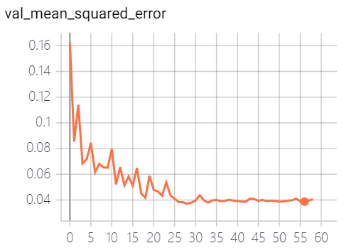

# Image-music-synesthesia-aware

## 首先使用提取好的 共128维度特征进行训练，均方差（mse）达到0.068，并不是很理想，但可以接受。

## 最终改进

图片特征：vgg19  512x1
音频特征：MFCC：400x1 + Chroma Frequencies：112x1
样本数量：250000（训练集225000）

回归网络：16层全连接网络，除输出层为sigmoid（将结果映射至0-1）外，其余层激活函数均为relu，以防止梯度消失或梯度爆炸.
loss function：mean square error
optimizer：adam

Layer1：全连接 1024维度
Layer2：全连接 1024维度
Layer3：全连接 512维度
Layer4：全连接 512维度
Layer5：全连接 256维度
Layer6：全连接 256维度
Layer7：全连接 128维度
Layer8：全连接 128维度
Layer9：全连接 64维度
Layer10：全连接 64维度
Layer11：全连接 32维度
Layer12：全连接 16维度
Layer13：全连接 16维度
Layer14：全连接 8维度
Layer15：全连接 8维度
output：sigmoid

当均方差不再下降时，学习率降低 *0.2

均方差最优达到0.0369，大概平均0.040

训练进行了59个epoch后自动停止
<body>
    </img>
</body>

 
 
 
