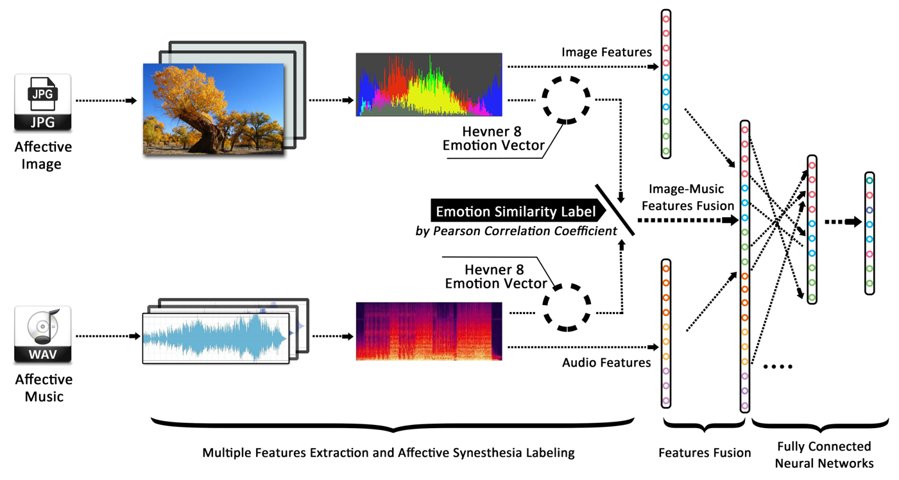
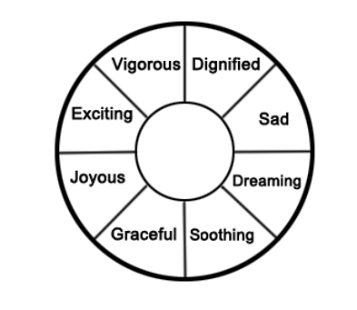
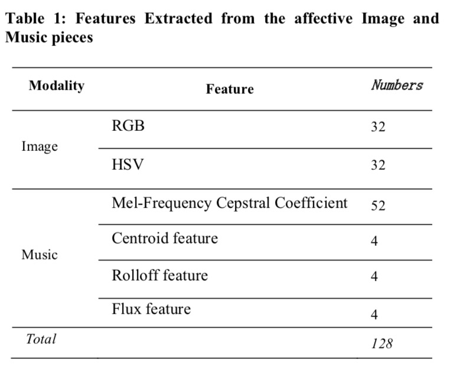
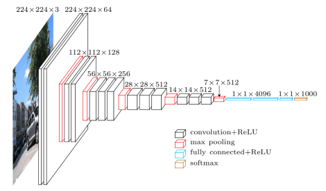
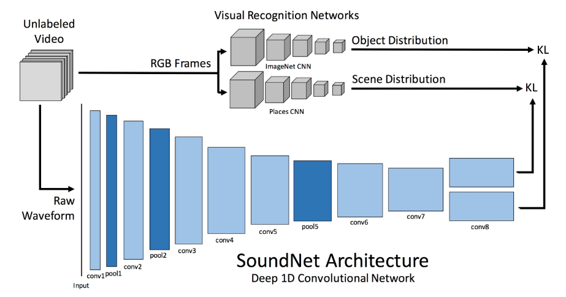
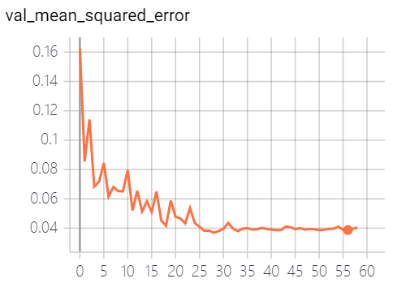

# Image-music-synesthesia-aware

-- 深度学习部分

## 示意图

</img>

从8个情感的维度来对音乐和图片进行描述

</img>

## 数据

- 已标定的：
    + 每个音乐段用8个情感维度进行标注
    + 每个图片  用8个情感维度进行标注
    + 音乐和图片对 之间基于8个维度的相似度（皮尔逊系数）

## 目标

训练一个全连接网络 进行相似度的预测。

## 度量

均方差（mse）

## stage 1 

首先使用提取好的 共128维度特征进行训练，均方差（mse）达到0.068，并不是很理想。

- 特征分析

    + 128维度 = 64维度的图片特征 + 64维度的音乐特征

    </img>

## stage 2

#### 特征提取

- 初步规划：
    + 512维特征 
        每一个维度扩大四倍，最终效果有所改进，均方差达到0.05左右，但是

- 图片特征提取： VGG-19     

    ***K. Simonyan and A. Zisserman, “Very deep convolutional networks for large-scale image recognition,” arXiv preprint arXiv:1409.1556, 2014.***
    
    </img>

- 音频特征提取： 

    [SoundNet](https://github.com/eborboihuc/SoundNet-tensorflow)

    </img>

## 最终

图片特征：vgg19  512x1
音频特征：MFCC：400x1 + Chroma Frequencies：112x1
样本数量：250000（训练集225000）

回归网络：16层全连接网络，除输出层为sigmoid（将结果映射至0-1）外，其余层激活函数均为relu，以防止梯度消失或梯度爆炸.
loss function：mean square error
optimizer：adam

Layer1：全连接 1024维度
Layer2：全连接 1024维度
Layer3：全连接 512维度
Layer4：全连接 512维度
Layer5：全连接 256维度
Layer6：全连接 256维度
Layer7：全连接 128维度
Layer8：全连接 128维度
Layer9：全连接 64维度
Layer10：全连接 64维度
Layer11：全连接 32维度
Layer12：全连接 16维度
Layer13：全连接 16维度
Layer14：全连接 8维度
Layer15：全连接 8维度
output：sigmoid

当均方差不再下降时，学习率降低 *0.2

均方差最优达到0.0369，大概平均0.040

训练进行了59个epoch后自动停止
<body>
    </img>
</body>

## 小练习

使用 VGG-16 进行图片特征提取，并使用 PCA 降维为一维向量。

 
 
 

